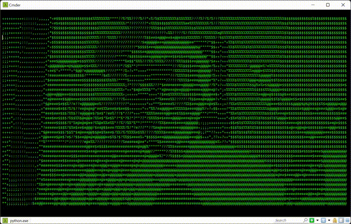

# matrix-webcam

Take your video conference from within the matrix.

## Running it

Make sure you have Python installed. Install the `opencv-python` package, i.e. with pip

    $ cd matrix-webcam
    $ python -m pip install -r requirements.txt
    $ python -m matrix-webcam

## Can I change the size or resolution

Yes! Just add the desired width and height in characters to the command, i.e.

    $ python main.py 120 30

## Can I use this for Teams/Zoom/Skype etc.? 

Yes! You can for example use [OBS Studio](https://obsproject.com/) together with the [Virtual webcam plugin](https://github.com/Fenrirthviti/obs-virtual-cam/releases).
Then all you need to do is select the virtual webcam in Teams/Zoom/Skype.

